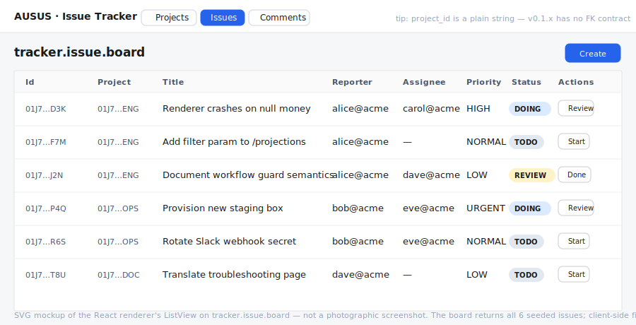

# Issue Tracker — AUSUS v0.1.x sample

A small production-style application built **only with implemented v0.1.x
capabilities** to stress-test the framework. It is also the source of
[FRAMEWORK-FINDINGS.md](./FRAMEWORK-FINDINGS.md) — an honest catalogue of
where v0.1.x bites and what v0.2 should fix.

## What it models

Three entities, two workflows, five projections.

```
project (ACTIVE → ARCHIVED)
   │
   *  «string-typed reference, FK by convention only»
   │
   ▼
issue   (TODO → DOING → REVIEW → DONE; · → WONTFIX from any non-terminal state)
   │
   *  «string-typed reference»
   │
   ▼
comment (append-only, no workflow)
```

Eight actions in total: `project.create`, `project.archive`, `issue.create`,
`issue.start`, `issue.review`, `issue.done`, `issue.wontfix`, `comment.post`.

Three roles: `tracker.member` (writes + transitions), `tracker.admin` (archive
project, force `wontfix`), `tracker.viewer` (projection-only).



## Layout

```
apps/issue-tracker/
├── composer.json          ← stand-alone consumer manifest (require ausus/standard-stack)
├── src/
│   └── IssueTrackerPlugin.php
├── bin/
│   └── seed.php           ← writes tracker.sqlite with 3 projects + 6 issues + 1 comment
├── public/
│   └── server.php         ← HTTP front controller — uses Application::http()
├── tests/
│   └── smoke.php          ← 27-assertion end-to-end test
├── ui/
│   ├── package.json       ← Vite + React 18/19 + @ausus/renderer-react
│   ├── src/{App.tsx,main.tsx,index.css}
│   └── index.html
├── screenshots/issue-board.svg
├── README.md              ← (this file)
├── ARCHITECTURE.md        ← layered view + decisions
└── FRAMEWORK-FINDINGS.md  ← honest v0.1.x friction report + v0.2 priorities
```

## Run it (monorepo dev)

The smoke test runs inside the monorepo with the existing root vendor:

```bash
php apps/issue-tracker/tests/smoke.php
# → RESULT: passed=27 failed=0
```

To bring up the full stack:

```bash
# 1. seed the SQLite file (one-shot)
php apps/issue-tracker/bin/seed.php

# 2. serve the HTTP API
php -S 127.0.0.1:8787 -t apps/issue-tracker/public apps/issue-tracker/public/server.php

# 3. in a second terminal, run the UI
cd apps/issue-tracker/ui
npm install
npm run dev    # → http://localhost:5173
```

## Run it (stand-alone)

The directory is a real consumer — its `composer.json` requires
`ausus/standard-stack` and `nyholm/psr7`. Outside the monorepo:

```bash
cd apps/issue-tracker
composer install
composer seed
composer serve         # serves :8787 with the seeded DB
```

The `ui/` folder is independent — install with `npm install` and point it at
the running PHP server.

## What this sample exercises

- `Application::create(ApplicationConfig::make()->…)` — the typed config builder.
- `Application::run(...)` — typed `InvocationResult` (used by the smoke test).
- `Application::http(request)` — one-call PSR-7 handling (used by `server.php`).
- `Field::enum(...)->default(...)` — defaulted enum that drives a workflow.
- `Field::string()->nullable()` — nullable string column (and the
  null-serialisation bug in §3 of the findings).
- `Action::create(...)` — three create actions, two of them with required and
  defaulted inputs the renderer turns into a real form.
- `Action::transition(...)->stamp(...)->addTransition(...)` — multi-source
  transition (`wontfix` from `TODO` / `DOING` / `REVIEW`).
- `->workflow(field:, initial:)` — explicit declaration (no implicit
  inference warning).
- Per-action `->requireRole(...)` policies + smoke-tested denial paths.
- Five projections — both list and detail shapes, including a no-workflow
  entity (`comment`).
- `@ausus/renderer-react` — `ViewSchemaConsumer` for every projection, the
  metadata-driven `ActionModal` create form, the workflow badge, the per-row
  action buttons.

## Verified

- Plugin compiles and the smoke test passes 27/27 with no deprecation noise.
- HTTP front controller starts on `php -S` and answers `/api/_health` with the
  graph hash.
- The UI dev server reaches the PHP server over CORS, lists the seeded items,
  drives transitions per row, and creates new records from the dynamic form
  generated out of `ActionDescriptor.inputs`.
- The monorepo build (`scripts/ci.sh`) wires the smoke test as a CI step.

## Read next

- [ARCHITECTURE.md](./ARCHITECTURE.md) — layered view, persistence shape,
  request lifecycle.
- [FRAMEWORK-FINDINGS.md](./FRAMEWORK-FINDINGS.md) — the v0.1.x friction
  catalogue and recommended v0.2 priorities. **This is the deliverable.**
